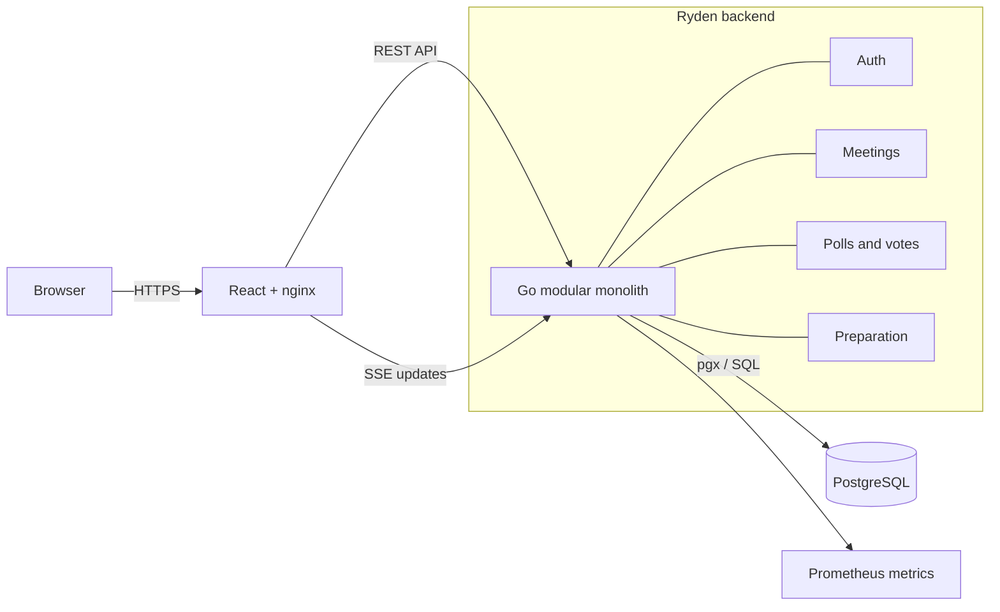
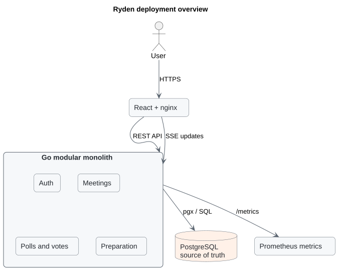

# Diagram rendering demo

This page shows the same Ryden deployment view in formats commonly used in GitHub repositories.

## Mermaid

GitHub renders the fenced `mermaid` block directly in Markdown.

## PlantUML

GitHub displays a `.puml` file as source code rather than rendering it natively. The generated SVG below is committed next to the [PlantUML source](ryden-architecture.puml), so it is visible in Markdown without a browser extension or external rendering at view time.

## Files

- [Mermaid embedded in Markdown](README.md#mermaid)
- [PlantUML source](ryden-architecture.puml)
- [PlantUML-generated SVG](ryden-architecture.svg)
